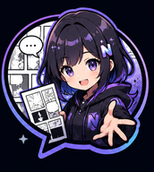

<div align="center">



# NYRA — AI Comic Translation

**Translate. Restore. Read.**
マンガを、すべての言語へ。

Penerjemah komik otomatis untuk Android. Deteksi balon → terjemah lewat LLM
vision → bersihkan latar → tulis ulang teks ke dalam balon, mengikuti font,
warna, dan bentuk aslinya.

[](#)
[](#)
[](#verifikasi)
[](#apk-siap-pasang)
[](#lisensi)

</div>

---

## Daftar isi

- [Apa ini](#apa-ini)
- [Hasil terjemahan sungguhan](#hasil-terjemahan-sungguhan)
- [APK siap pasang](#apk-siap-pasang)
- [Cara pakai](#cara-pakai)
- [Cara kerja pipeline](#cara-kerja-pipeline)
- [Fitur](#fitur)
- [Model yang dipakai](#model-yang-dipakai)
- [Keamanan](#keamanan)
- [Membangun dari sumber](#membangun-dari-sumber)
- [Verifikasi](#verifikasi)
- [Arsitektur kode](#arsitektur-kode)
- [Riwayat perbaikan](#riwayat-perbaikan)
- [Batas yang diketahui](#batas-yang-diketahui)
- [Lisensi](#lisensi)

---

## Apa ini

NYRA berawal sebagai port asli-native dari [cypy](https://github.com/indravoyager/cypy)
(MIT, Python + GUI desktop), dan kini sudah jauh melampauinya: detektor
tiga-kelas RT-DETR-v2, inpainting LaMa, pengukuran warna balon, kontur balon,
editor kotak, perpustakaan + pembaca, manajemen model, ekspor CBZ, resume,
glosarium, cache terjemahan, dan penghitungan biaya token.

**Ini bukan wrapper WebView, bukan mockup, bukan demo.** Seluruh pipeline
berjalan on-device dengan Kotlin + ONNX Runtime. Satu-satunya yang lewat
jaringan adalah panggilan terjemahan ke LLM pilihan Anda.

| | |
|---|---|
| Bahasa | Kotlin 100 %, satu modul `app` |
| Inferensi | ONNX Runtime (on-device) |
| minSdk / targetSdk | 24 (Android 7.0) / 34 |
| ABI rilis | arm64-v8a (armeabi-v7a & x86_64 bisa dibangun sendiri) |
| Bahasa sasaran | ID, EN, JP, ZH, ES, PT, JV, KO, RU, TH |
| Tes | 619 tes / 69 kelas, semua hijau |

---

## Hasil terjemahan sungguhan

Bukan tangkapan layar promosi. Di bawah ini satu halaman utuh
**SPY × FAMILY Mission 139** yang diproses apa adanya oleh NYRA v2.5.x,
Jepang → Indonesia, tanpa koreksi manual.

Sepuluh balon terdeteksi, sepuluh diterjemahkan:

| # | Asli (JP) | Hasil NYRA (ID) |
|---|---|---|
| 1 | オレは西国一の諜報員〈黄昏〉 | AKU ADALAH AGEN RAHASIA NOMOR SATU WESTALIS, ⟨SENJA⟩. |
| 2 | 数々の逆境に抗ってきた | TELAH MELAWAN BERBAGAI MACAM SITUASI SULIT, |
| 3 | そのオレが今 | AKU YANG SEKARANG, |
| 4 | ナースなめないでください | JANGAN REMEHKAN SUSTER, KUMOHON. |
| 5 | 素人2人に屈している…ッ!! | MALAH TAKLUK PADA 2 ORANG AMATIRAN...!! |
| 6 | 治す気あるんですか先生！ | ANDA BERNIAT MENYEMBUHKANNYA TIDAK, SENSEI!! |
| 7 | 緊急事態だというのに…!! | PADAHAL INI SITUASI DARURAT...!! |
| 8 | うぐっ… | UGH... |
| 9 | ほら言わんこっちゃない | MAKANYA, JANGAN BILANG-BILANG KALAU TIDAK MAU. |
| 10 | くっ…すまん夜帷!!もう少しかかる…!! | UGH... MAAFKAN AKU, YORU!! SEBENTAR LAGI...!! |

Yang pantas diperhatikan dari hasil di atas:

- **Furigana tidak ikut terbaca dua kali.** `西国`/`ウェスタリス` dan
  `黄昏`/`たそがれ` menghasilkan satu kalimat, bukan campuran.
- **Honorifik dipertahankan.** `先生` tetap menjadi *sensei*, tidak menjadi
  "guru" atau "dokter".
- **Nada dijaga.** Balon 4 tetap berupa protes sopan; balon 6 tetap tuntutan.
- **Urutan baca kanan-ke-kiri ditebak sendiri** dari bentuk blok teks, sehingga
  balon 1 → 2 → 3 mengalir sebagai satu kalimat yang bersambung antar panel.
- **Balon 8 hanya berisi erangan** dan tetap diterjemahkan. Ini justru bug yang
  baru diperbaiki di v2.3.1 — lihat [studi kasus di bawah](#studi-kasus-satu-balon-yang-luput-v231).

### Studi kasus: satu balon yang luput (v2.3.1)

Seorang pengguna melaporkan bahwa pada halaman di atas, **sembilan balon
diterjemahkan dan tepat satu tidak tersentuh**: balon kecil berisi `うぐっ…`.

Diagnosisnya dikerjakan dengan membandingkan piksel keluaran terhadap piksel
sumber, kotak demi kotak:

```
bubble  box                        %piksel berubah   status
  #1    [573, 28, 715, 304]          15.5%          OK diterjemahkan
  #2    [20, 37, 169, 314]           15.9%          OK diterjemahkan
  #3    [621, 376, 720, 655]          7.4%          OK diterjemahkan
  #4    [396, 388, 501, 495]         16.5%          OK diterjemahkan
  #5    [0, 375, 173, 683]           11.6%          OK diterjemahkan
  #6    [114, 709, 233, 852]         13.7%          OK diterjemahkan
  #7    [614, 921, 719, 1110]        14.6%          OK diterjemahkan
  #8    [494, 940, 560, 1062]         0.0%          >>> TIDAK TERSENTUH <<<
  #9    [401, 1014, 508, 1151]       15.8%          OK diterjemahkan
  #10   [263, 940, 375, 1168]        18.5%          OK diterjemahkan
```

Dugaan pertama — "detektornya gagal" — **salah**. Menjalankan `rtdetr.onnx`
yang sungguhan atas halaman itu memberi balon tersebut skor **0,893**, jauh di
atas ambang 0,45, dan kotaknya lolos `sanitize`, `mergeOverlapping`, maupun
`dropAbsurd`. Kotaknya ada, nomor merahnya tercetak, gambarnya terkirim.

Penyebab sebenarnya ada **di dalam prompt kami sendiri**:

```
SFX RULE:
1. If a bubble contains ONLY sound effects (SFX) with no dialogue, reply with 'SKIP'.
...
Example output: {"1": "...", "2": "SKIP", "3": "...", ...}
```

`うぐっ…` secara harfiah memang bunyi, jadi model **menuruti instruksi kami**
dan mengembalikan `SKIP` — diperkuat contoh keluaran yang memasang `SKIP`
tepat di ID 2. Pipeline lalu bekerja persis seperti seharusnya: `drawText`
menolak `SKIP`, `sasaranInpaint` juga menolaknya, jadi tidak ada yang dihapus
dan tidak ada yang digambar. Balonnya utuh dalam bahasa Jepang.

Bukti paling telak ada di balon 10: `くっ…` — erangan yang sama persis —
**berhasil** diterjemahkan menjadi "UGH..." semata-mata karena ia duduk
bersebelahan dengan dialog di balon yang sama.

**Perbaikannya** memisahkan suara yang keluar dari mulut tokoh (dialog) dari
bunyi lingkungan yang digambar sebagai artwork (SFX):

```
SFX AND VOICE RULE:
1. A sound a CHARACTER MAKES WITH THEIR VOICE is dialogue, not SFX. Always translate it.
2. This includes groans, gasps, cries, laughs, screams, sighs, grunts, hesitation and stammering.
3. Examples that MUST be translated: うぐっ, ぐっ, あっ, はぁ, うわぁ, ひっ, んっ, えっ, ふふ, あはは, きゃー, うっ, ぐぬぬ.
...
6. Even so, if such a sound sits INSIDE a speech bubble, translate it rather than skipping it.
```

Contoh keluaran pun tidak lagi mengajarkan `SKIP` untuk erangan.

Pelajarannya dicatat di sini karena mudah terulang: **balon yang tidak
diterjemahkan belum tentu balon yang tidak terdeteksi.** Verifikasi dulu
detektornya sebelum mengutak-atik ambang deteksi — kalau tidak, Anda akan
melonggarkan ambang sampai muncul ratusan kotak palsu demi bug yang sumbernya
ada di satu baris prompt.

Dijaga oleh `VocalSfxTest` (6 tes). Mengembalikan aturan lama membuat tepat
3 tes gagal — jadi tes ini benar-benar mengikat, bukan hiasan.

### Teks yang sengaja TIDAK disentuh

Pada halaman yang sama ada tulisan tegak `辿り着くこと、叶わず` yang menyatu
dengan artwork di tengah panel, dan logo `MISSION:139 前編`. Keduanya memang
dibiarkan utuh: keduanya bukan balon, melainkan bagian dari gambar. Menghapus
dan menimpanya berarti merusak artwork. Perilaku ini disengaja — lihat
[kontrak hapus-dan-gambar](#kontrak-hapus-dan-gambar).

---

## APK siap pasang

| Berkas | ABI | Ukuran |
|---|---|---|
| `nyra-2.7.1-arm64-v8a.apk` | arm64-v8a | 53.529.788 B |
| `nyra-2.7.1-armeabi-v7a.apk` | armeabi-v7a | 48.118.556 B |
| `nyra-2.7.1-x86_64.apk` | x86_64 | 56.280.590 B |

Pilih **arm64-v8a** untuk hampir semua ponsel Android sejak 2016; armeabi-v7a
hanya untuk perangkat 32-bit lama, dan x86_64 untuk emulator.

SHA-256 sengaja **tidak** dicantumkan di sini. Blok tanda tangan APK memuat
stempel waktu, sehingga dua build dari commit yang sama persis menghasilkan
ringkasan yang berbeda meski ukuran, sertifikat, dan isinya identik —
angka yang ditulis di README akan menyesatkan begitu APK dibangun ulang.
Ringkasan yang mengikat adalah yang tertera pada **GitHub Release** untuk
tag terkait; verifikasi berkas unduhan Anda terhadap angka di halaman itu.

Yang tetap dan bisa diperiksa kapan pun adalah **sertifikat penerbitnya**
(lihat di bawah): APK NYRA yang sah selalu ditandatangani kunci yang sama.

> APK berukuran 48-56 MB dan **tidak disimpan di dalam repo** (`apk/` masuk
> `.gitignore`) agar riwayat git tetap ringan. Unggah berkasnya sebagai
> **GitHub Release**, atau bangun sendiri dengan `./gradlew assembleRelease`.

Ditandatangani APK Signature Scheme v2, RSA-4096:

```
CN=NYRA, OU=AI Comic Translation, O=NYRA, L=Karawang, ST=West Java, C=ID
SHA-256: bd59a5e08b3eaa201e730d06eceaaf01d5d21baf6f354ae7e7b78f2384784f87
```

`minSdk 24` (Android 7.0), `targetSdk 34`, versionCode 21. Kode diperkecil dan
diaburkan R8 (`isMinifyEnabled = true`).

Verifikasi sebelum memasang:

```bash
# Cocokkan dengan ringkasan yang tertera di halaman GitHub Release:
sha256sum nyra-2.7.1-arm64-v8a.apk

# Pemeriksaan yang paling menentukan - sertifikat harus persis seperti di atas:
apksigner verify --print-certs nyra-2.7.1-arm64-v8a.apk
```

---

## Cara pakai

1. **Pasang APK**, izinkan "Install unknown apps" bila diminta.
2. **Isi API key.** Setelan → pilih penyedia (Gemini / OpenAI / OpenRouter /
   custom OpenAI-compatible) → tempel API key. Key disimpan terenkripsi
   (AES-GCM, Android Keystore).
3. **Pilih masukan.** Gambar lepas, folder, ZIP/CBZ/CBR, PDF, atau EPUB.
4. **Pilih bahasa sasaran** dan folder keluaran.
5. **Jalankan.** Progres tampil per halaman; proses bisa dibatalkan dan
   dilanjutkan nanti dari titik terakhir.
6. **Koreksi bila perlu.** Perpustakaan → pilih bab → Editor untuk menggeser
   kotak atau menyunting teks, atau Pembaca untuk membaca hasilnya.

Model inpaint LaMa (93 MB) bersifat opsional dan diunduh terpisah lewat
Setelan → Model. Tanpa model itu, latar balon diisi putih polos.

---

## Cara kerja pipeline

```
 masukan (gambar / ZIP / CBZ / CBR / PDF / EPUB)
   │
   ├─ 1. Deteksi        RT-DETR-v2 tiga kelas: bubble, text_bubble, text_free
   │                    fallback YOLOv8 satu kelas bila model tidak ada
   ├─ 2. Arah baca      ditebak per halaman dari bentuk blok teks + rasio
   ├─ 3. Warna          latar & huruf tiap balon diukur (balon gelap aman)
   ├─ 4. Mosaik         ≤20 balon per gambar, tiap balon diberi nomor merah
   ├─ 5. Terjemah       satu panggilan LLM vision per mosaik → JSON {id: teks}
   │                    cache piksel menghindari bayar dua kali
   ├─ 6. Bersihkan      LaMa untuk teks lepas, isi-putih untuk isi balon
   └─ 7. Render         teks ditulis ulang mengikuti kontur balon, font & warna
   │
 keluaran PNG per halaman → opsional CBZ
```

Kunci desainnya: **satu panggilan jaringan per mosaik**, bukan per balon.
Halaman 10 balon = 1 permintaan, bukan 10.

### Kontrak hapus-dan-gambar

Aturan yang mengikat seluruh pipeline:

> **Hapus sesuatu hanya kalau kita memang berniat menggambar penggantinya.**

`sasaranInpaint` dan `drawText` wajib memakai predikat bentuk yang sama persis
(`bentukDitolak`). Dulu hanya `drawText` yang memakainya sementara inpaint
menghapus semua teks lepas tanpa saring — hasilnya bercak buram di atas artwork
tanpa teks apa pun di atasnya. Teks kosong dan `SKIP` juga ditolak keduanya.

---

## Fitur

### Terjemahan

| Fitur | Ringkas |
|---|---|
| **Multi-penyedia** | Gemini, OpenAI, OpenRouter, dan sembarang endpoint OpenAI-compatible. |
| **Mosaik bernomor** | ≤20 balon per permintaan, ID merah Komika 40 px. Hemat token dan menjaga konteks antar balon. |
| **Glosarium** | TSV `istilah → terjemahan → catatan`. Nama tokoh dan istilah dunia konsisten sepanjang bab. |
| **Konteks halaman** | Ringkasan halaman sebelumnya ikut dikirim agar dialog bersambung. |
| **Gambar rujukan** | Halaman utuh ikut dilampirkan sebagai konteks visual (hanya bila benar-benar dikirim). |
| **Cache terjemahan** | Balon identik tidak dibayar dua kali. Kunci = sidik piksel + bahasa + model. |
| **Hitung biaya** | Token masuk/keluar dan estimasi biaya USD + rupiah, per model. |
| **Arah baca otomatis** | Manga kanan-ke-kiri vs manhwa/komik Barat kiri-ke-kanan, ditebak per halaman. |

### Gambar

| Fitur | Ringkas |
|---|---|
| **Kontur balon** | Teks mengikuti bentuk balon sungguhan, bukan kotak. Diturunkan dari kotak RT-DETR + Otsu, tanpa model segmentasi tambahan. |
| **Warna otomatis** | Latar & huruf diukur per balon; balon hitam tetap hitam dengan huruf putih. |
| **Garis luar huruf** | Outline mengikuti warna asli, bukan selalu hitam. |
| **Inpaint LaMa** | Teks di luar balon dihapus mulus (opsional, model 93 MB diunduh terpisah). |
| **Paket font** | Komika (Latin), Kosugi (JP), Noto KR/SC/Thai untuk sasaran non-Latin. |
| **Teks tegak** | Penulisan vertikal untuk sasaran Jepang/Mandarin. |

### Alur kerja

| Fitur | Ringkas |
|---|---|
| **Perpustakaan** | Semua bab tersimpan, dengan indikator kelengkapan terjemahan. |
| **Pembaca** | Baca hasil langsung di aplikasi, overlay penuh layar. |
| **Editor kotak** | Geser, ubah ukuran, tambah, hapus kotak; sunting teks per balon. Render selalu dari halaman bersih, jadi menyunting sepuluh kali sama hasilnya dengan sekali. |
| **Gaya huruf manual** | Ketebalan, besar teks, dan jarak baris per balon bisa ditimpa saat tipografi otomatis salah menebak. Pilihan disimpan dan tidak ditimpa pengukuran ulang. |
| **Hapus watermark** | Cari otomatis kandidat (berulang antar halaman / di tepi) atau gambar kotaknya sendiri; ditambal LaMa bila terpasang, kalau tidak dengan penambal salin-cermin lokal. Non-destruktif: kotaknya disimpan, urung = hapus kotak. |
| **Manajemen model** | Status tiap model (belum ada / separuh / terpasang / terverifikasi / rusak), verifikasi SHA-256 atas permintaan, hitung ruang terpakai. |
| **Resume** | Arsip yang terhenti dilanjutkan dari halaman terakhir, diukur dari permintaan yang benar-benar sampai ke server. |
| **Ekspor CBZ** | Hasil dibungkus jadi satu berkas. |
| **Banyak format** | Gambar, folder, ZIP, CBZ, CBR, PDF, EPUB. |

---

## Model yang dipakai

| Model | Berkas | Ukuran | Lisensi | Sumber |
|---|---|---|---|---|
| Detektor balon 3-kelas | `rtdetr.onnx` | 11,1 MB | Apache-2.0 | [ogkalu/comic-text-and-bubble-detector](https://huggingface.co/ogkalu/comic-text-and-bubble-detector) |
| Detektor teks | `ocr_det.onnx` | 4,6 MB | Apache-2.0 | [nathanfhh/PaddleOCR-ONNX](https://github.com/nathanfhh/PaddleOCR-ONNX) (PP-OCRv5 mobile det) |
| Detektor balon lama | `eyecypy.onnx` | 12,3 MB | MIT | cypy (YOLOv8, 1 kelas) |
| Inpaint | `lama.onnx` | 92,6 MB | — | [opencv/inpainting_lama](https://huggingface.co/opencv/inpainting_lama) — **diunduh terpisah**, tidak dibundel |

Tiga model pertama dibundel di dalam APK. LaMa diunduh atas permintaan dan
diverifikasi SHA-256 `7df918ac…cf74fdf2` sebelum dipakai.

**Catatan lisensi yang disengaja:** bobot segmentasi balon berbasis YOLO-seg
umumnya turunan Ultralytics dan **AGPL-3.0**, yang akan menular ke APK yang
didistribusikan. Karena itu NYRA sama sekali tidak memakai YOLO-seg; kontur
balon diturunkan dari kotak RT-DETR yang Apache-2.0.

### Catatan model Gemini

Nama model Gemini berubah cukup sering dan yang lama dimatikan. NYRA memakai
rantai fallback `gemini-flash-latest` → `gemini-3.6-flash` →
`gemini-flash-lite-latest`. Model yang sudah pensiun dan akan menghasilkan 404:
`gemini-2.0-*`, `gemini-1.5-*`, `gemini-pro*`, `gemini-2.5-flash*`.

Pembatas laju: jarak antar permintaan ≥2,0 detik, backoff 429 `5×2^percobaan`,
maksimum 6 percobaan.

---

## Keamanan

- **API key terenkripsi.** AES-GCM lewat Android Keystore (alias
  `nyra_api_key_v1`). Nilai lama yang belum terenkripsi ditandai `raw1:` dan
  dimigrasikan otomatis menjadi `enc1:`.
- **Glosarium adalah data, bukan perintah.** Isi glosarium dipagari
  `--- BEGIN/END GLOSSARY DATA ---`, dan karakter kontrol / bidi / zero-width
  dibuang. JSON glosarium adalah vektor injeksi prompt yang sungguhan, dan
  diperlakukan begitu.
- **Verifikasi unduhan.** Model yang diunduh di-hash streaming (tidak pernah
  `readBytes()` berkas 93 MB) dan ditolak bila SHA-256 tidak cocok. Unduhan
  separuh disimpan `.part` dan dilanjutkan lewat HTTP Range.
- **Kunci penanda tangan tidak ada di repo.** `*.jks` dan
  `keystore.properties` masuk `.gitignore`.
- **Cleartext dimatikan** kecuali untuk endpoint custom yang Anda tentukan
  sendiri (`network_security_config.xml`).

---

## Membangun dari sumber

Prasyarat: JDK 17, Android SDK (platform 34, build-tools 34.0.0).

```bash
git clone https://github.com/lingxudr/Nyra.git
cd Nyra
echo "sdk.dir=/path/ke/android-sdk" > local.properties

# taruh model di app/src/main/assets/
#   eyecypy.onnx  ocr_det.onnx  rtdetr.onnx  komika.ttf  kosugi.ttf

./gradlew assembleRelease
```

Model dan font **tidak** disimpan di repo (ukuran). Tanpa keduanya, kode tetap
terkompilasi tetapi ±42 tes akan gagal dengan `FileNotFoundException`.

### Menandatangani dengan kunci sendiri

```bash
keytool -genkeypair -v -keystore nyra-release.jks \
  -keyalg RSA -keysize 4096 -validity 10000 -alias nyra

cat > keystore.properties <<'EOF'
storeFile=nyra-release.jks
storePassword=...
keyAlias=nyra
keyPassword=...
EOF
```

Keduanya sudah masuk `.gitignore`. Bila `keystore.properties` tidak ada, build
rilis jatuh ke debug-signing secara otomatis.

> Di `.gradle.kts`, `java.util.Properties` tidak ikut ter-*resolve* sendiri —
> `import java.util.Properties` dan `import java.io.FileInputStream` di
> tingkat atas berkas wajib ada.

---

## Verifikasi

```bash
./gradlew testReleaseUnitTest
```

**619 tes / 69 kelas / 0 gagal.**

Tes di sini sengaja diperlakukan sebagai bukti, bukan formalitas. Aturan yang
dipegang:

- **Tes fitur harus menyalakan sakelar fiturnya.** Tes pipeline yang lupa
  mengaktifkan fitur akan hijau tanpa pernah menyentuh kode yang diuji.
- **Tes piksel Robolectric wajib `@GraphicsMode(NATIVE)`**, kalau tidak ia
  lulus secara hampa.
- **`android.graphics.Color.red/green/blue` mengembalikan 0** di unit test JVM
  biasa. Semua matematika piksel memakai geseran bit, di produksi maupun di
  fixture.
- **Uji mutasi.** Setiap perbaikan penting dibalik sekali untuk memastikan
  tesnya memang gagal. Contoh: mengembalikan aturan SFX lama → tepat 3 tes
  `VocalSfxTest` gagal; melepas penjaga `milikSendiri` → tepat 2 tes
  `ReaderLayerTest` gagal; memaksa `verifikasi` selalu lulus → tepat 2 tes
  `ModelManagerTest` gagal.
- **Resume tidak boleh percaya "berkasnya sudah ada"** — yang diukur adalah
  permintaan yang benar-benar sampai ke server.

Kelas tes terpilih:

| Kelas | Yang dibuktikan |
|---|---|
| `VocalSfxTest` | Erangan tokoh diterjemahkan; `SKIP` tetap tidak menghapus apa pun. |
| `BubbleContourRealPageTest` | Kontur atas artwork manga sungguhan, bukan fixture sintetis. |
| `InpaintSmearTest` | Tidak ada bercak buram tanpa teks di atasnya. |
| `GlossaryInjectionTest` | Glosarium tidak bisa membajak prompt. |
| `ResumePipelineTest` | Lanjutan diukur dari permintaan nyata. |
| `ModelIntegrityTest` | SHA-256 sungguhan atas berkas sungguhan. |
| `ReaderLayerTest` | Berkas sumber tidak pernah berubah satu byte pun. |

---

## Arsitektur kode

Satu modul `app`, paket `com.nyra.comic`, 41 berkas Kotlin.

| Berkas | Tanggung jawab |
|---|---|
| `Pipeline.kt` | Orkestrasi ujung-ke-ujung; berisi `buildPrompt`. |
| `RtDetector.kt` / `RtMath.kt` | RT-DETR 3 kelas + matematika murninya. |
| `YoloDetector.kt` / `DetectMath.kt` | Jalur detektor lama. |
| `BoxUtils.kt` | Sanitasi, penggabungan, urutan baca. |
| `BubbleContour.kt` | Kontur balon dari kotak + Otsu. |
| `TextRenderer.kt` / `FontPack.kt` | Tata letak teks, font, teks tegak. |
| `Inpainter.kt` / `InpaintMath.kt` | LaMa. |
| `Palette.kt` | Pengukuran warna balon. |
| `Providers.kt` / `RateLimiter.kt` | Klien LLM, pembatas laju, backoff. |
| `TranslationCache.kt` / `Usage.kt` | Cache piksel, akuntansi token. |
| `Glossary.kt` / `PageContext.kt` / `PageReference.kt` | Bahan konteks prompt. |
| `Library.kt` / `Project.kt` / `Resume.kt` | Persistensi & kelengkapan. |
| `ModelManager.kt` / `ModelDownloader.kt` | Status, unduhan, verifikasi. |
| `SecretStore.kt` | API key terenkripsi. |
| `*Activity.kt` | Main, Result, Editor, Library, Reader, Models. |

Seam pengujian di `Pipeline`: `detectorOverride`, `textDetectorOverride`,
`rtDetectorOverride`, `inpaintOverride`, `providerOverride`,
`glossaryOverride`, `cacheOverride`.

---

## Riwayat perbaikan

Ringkas, dari yang terbaru. Rinciannya tersimpan di riwayat commit.

| Versi | Isi |
|---|---|
| **v2.7.1** | Serpihan teks dari panel dan balon berbeda tidak lagi runtuh jadi satu blok seukuran halaman: toleransi penggabungan dihitung dari ukuran serpihan, bukan dari blok yang sedang tumbuh. Ikut menghapus tambalan zaitun di atas artwork, dan tambalan yang warnanya menyimpang jauh dari sekitarnya kini ditolak. Pengemasan petak inpaint diperbaiki (5 -> 3 inferensi per halaman uji). Sisi kecepatan: durasi tiap tahap kini dicatat dan diringkas di log, berkas kerja disimpan sebagai WEBP lossless (bukan PNG) sehingga penyimpanan antar-tahap jauh lebih cepat tanpa kehilangan mutu, jumlah utas inferensi dibatasi agar tidak melawan penjadwal big.LITTLE, dan ada opsi baru untuk membatasi inpaint hanya pada teks besar. |
| **v2.7.0** | Penghapus watermark (salin-cermin lokal, 71,3 % piksel pulih vs 53,4 % difusi) dan penimpaan gaya huruf per balon saat tipografi otomatis salah menebak. Label versi di layar utama diperbaiki — sempat tertulis tetap "v2.0.0" selama enam rilis. |
| **v2.6.0** | Detektor OCR kini jadi lapisan kedua di jalur RT-DETR, sehingga teks tanpa balon (mis. Jepang tegak di latar polos) tidak lagi lolos tanpa terjemahan. Penengahan tegak dihitung dari siluet tinta, bukan metrik font: kemiringan 11/11/16/7 px turun jadi 0/0/1/0 px. |
| **v2.5.1** | Kotak yang penata teks pasti tolak tidak lagi dikirim ke provider (hemat token), dan terjemahan yang gagal tergambar kini dilaporkan, bukan hilang diam-diam. |
| **v2.5.0** | Tipografi adaptif: ukuran, spasi, tebal, dan orientasi diukur dari teks aslinya. Terjemahan paralel per gelombang. |
| **v2.3.1** | Erangan tokoh tidak lagi di-`SKIP` (studi kasus di atas). |
| **v2.3.0** | Manajemen model: status, verifikasi SHA-256 atas permintaan, ruang terpakai. |
| **v2.2.0** | Perpustakaan + pembaca. Sebelumnya hanya bab terbaru yang bisa dibuka, bab lama tak terjangkau dan diam-diam terhapus. |
| **v2.1.0** | Kontur balon: teks mengikuti bentuk balon, bukan kotak. |
| **v2.0.0** | Rebranding NYRA; arah baca otomatis, cache terjemahan, akuntansi biaya, pengerasan rilis (R8, −3,5 MB). |
| Ronde 22 | Editor kotak, ekspor CBZ, paket font. |
| Ronde 21 | Konteks visual halaman, warna garis luar, EPUB, lanjut-arsip. |
| Ronde 18 | Proyek tersimpan, koreksi manual; perbaikan bercak buram & balon bersih ikut terhapus. |
| Ronde 15 | APK 149 MB → 57 MB. |
| Ronde 14 | Konteks halaman sebelumnya, inpaint LaMa. |
| Ronde 13 | Glosarium istilah. |
| Ronde 12 | Detektor RT-DETR dan pengukuran warna balon. |

Beberapa jebakan yang sudah dibayar mahal dan tidak perlu diulang:

- Kotak berukuran negatif dari decoder YOLO ber-area 0, dan area 0 meracuni
  setiap perbandingan rasio di hilir — **satu** kotak cacat bisa menghapus
  seluruh balon sah di halaman itu. Karena itu `sanitize` berjalan lebih dulu.
- Aturan "buang kalau menelan satu kotak 2,5× lebih kecil" menghapus balon
  berduri (SCRIIII, STOOOP!), karena durinya sendiri terdeteksi sebagai kotak
  kecil. Sekarang hanya dibuang bila menelan ≥2 kotak yang saling terpisah.
- Aturan tinggi-relatif pada webtoon strip 1080×11700 mengubah balon biasa
  menjadi "spanduk datar": 15 balon benar menjadi 10. Strip memakai tinggi
  acuan tersendiri.
- Anti-aliasing adalah jebakan untuk deteksi garis; jarak-ke-segmen yang
  membedakan. Memilih warna huruf sebagai "piksel terjauh dari latar" justru
  menukar isi dengan garis luar.
- Sidik piksel 32×32 **tidak** invarian skala — 70 dari 1024 byte berbeda
  antara render 120×200 dan 240×400 untuk gambar yang sama.
- `Paint.hasGlyph` mengembalikan true untuk Adlam/Cuneiform/Linear-B, jadi
  Robolectric tidak bisa membuktikan tofu. Cakupan cmap font tidak meramalkan
  tofu.

---

## Batas yang diketahui

- Teks yang menyatu dengan artwork (tategaki di tengah panel, logo bab)
  sengaja tidak disentuh. Menimpanya akan merusak gambar.
- SFX besar yang digambar tangan di luar balon hanya dibersihkan bila model
  LaMa terpasang; tanpanya, dibiarkan apa adanya.
- OCR lokal belum ada — pembacaan teks sepenuhnya dilakukan LLM vision. Ini
  berarti butuh jaringan dan API key.
- Terjemahan bergantung pada kualitas model yang Anda pilih. Model kecil murah
  cenderung memotong kalimat panjang.
- Hanya arm64-v8a yang dirilis; ABI lain harus dibangun sendiri.

### Balon yang tetap tidak diterjemahkan

Sebagian kotak memang **sengaja** tidak digambari teks, dan itu bukan
kegagalan. Penata teks menolak kotak yang bentuknya mustahil untuk sebuah
balon — rasio lebar:tinggi ≥ 3,2 sambil selebar ≥ 35 % halaman, atau luasnya
≥ 3,5 % halaman dengan rasio ≥ 2,8. Bentuk begitu hampir selalu panel utuh,
bilah judul, atau SFX yang membentang; menimpanya akan merusak artwork.

Sejak v2.5.1 saringan itu dijalankan **sebelum** potongan dikirim, bukan
sesudah. Dulu kotak semacam ini tetap ikut dibayar sebagai token lalu hasilnya
dibuang tanpa jejak di log. Pada berkas oracle repo ini 61 dari 480 kotak
(12,7 %) masuk golongan tersebut.

Yang tampil di log sekarang:

| Baris | Artinya |
|---|---|
| `N kotak dilewati sebelum dikirim` | Bentuknya ditolak; tidak ada token terpakai. |
| `N terjemahan tidak tergambar` | Model menjawab tapi kotaknya ditolak. Terjemahannya tersimpan di proyek dan bisa ditempatkan manual lewat editor. |
| `N balon dibiarkan dalam bahasa asli` | Provider tidak menjawab atau proses dihentikan. Jalankan ulang untuk melengkapi. |

Ketiganya berbeda sebab, jadi ditulis terpisah. Kalau sebuah balon hilang
tanpa salah satu baris di atas, itu bug — laporkan beserta halamannya.

---

## Lisensi

MIT.

Berbasis [cypy](https://github.com/indravoyager/cypy) (MIT). Ide-ide arsitektur
ditelaah dari [comic-translate](https://github.com/ogkalu2/comic-translate)
(Apache-2.0) dan [BallonsTranslator](https://github.com/dmMaze/BallonsTranslator)
(GPL-3.0, **ide saja, tanpa kode**).

Model dan font memiliki lisensinya masing-masing: RT-DETR & PP-OCR Apache-2.0,
Noto SIL OFL 1.1. Lihat [tabel model](#model-yang-dipakai).
